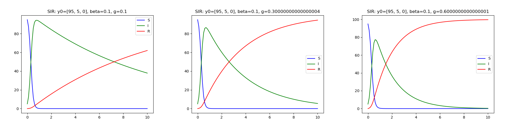

01: Histogramowanie słów
---

Prawie wszystko zrobione

02: Model Isinga
---

03: dekoratory
---

Zrobione

04: Numba
---
Test 100 iteracji pola 100x100

Numba:

    real    1m12,879s
    user    0m59,938s
    sys     0m13,063s

Bez numby:

    real    1m47,522s
    user    1m33,667s
    sys     0m13,462s

mach: Intel(R) Core(TM) i3-2350M CPU @ 2.30GHz

05: scrape statyczny
---
TODO: lab005

06: scrape Selenium
---
TODO: lab006

07: Model SIR i odeint
---
Model SIR policzony za pomocą `odeint`

